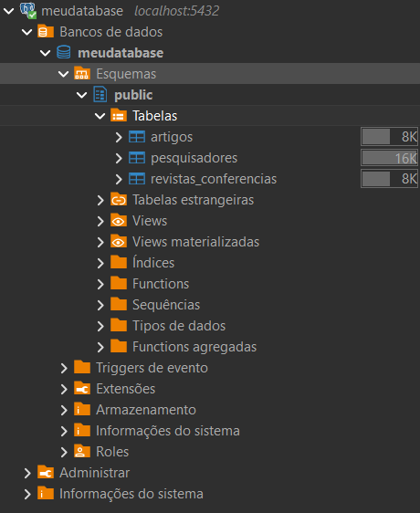
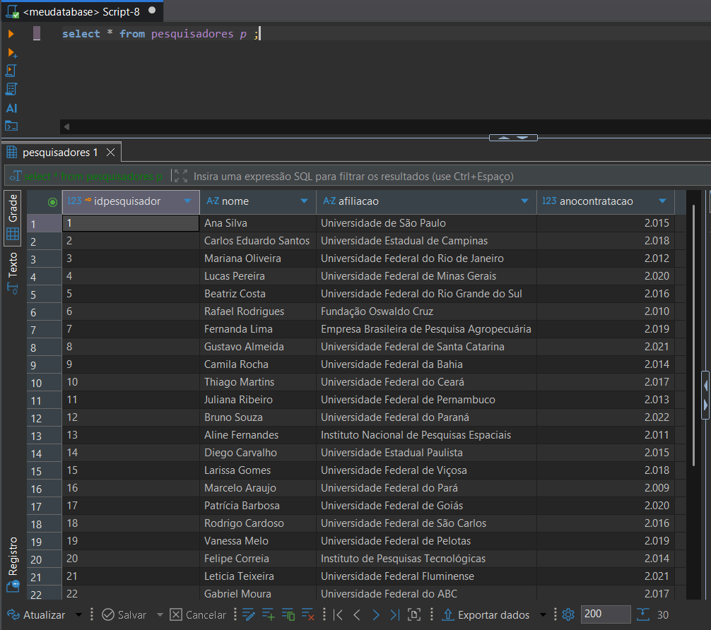
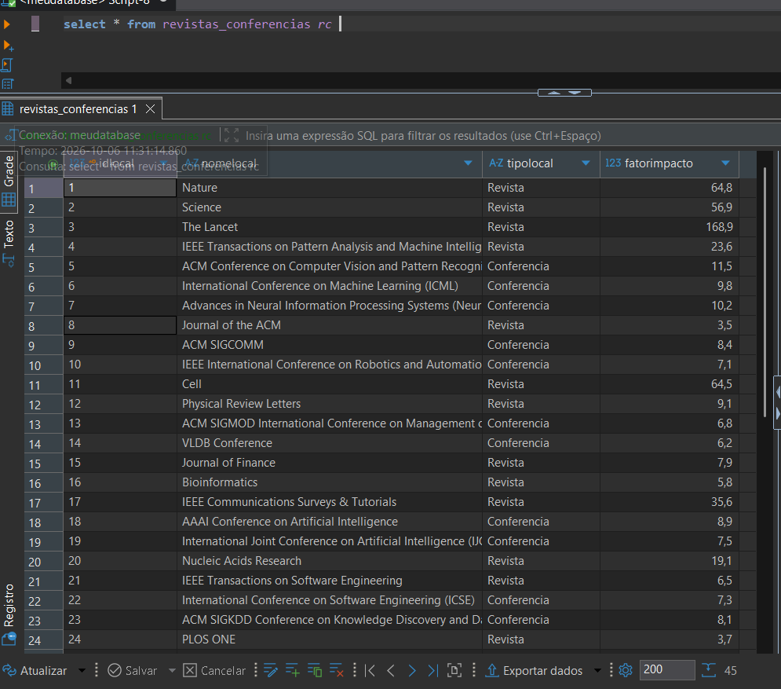
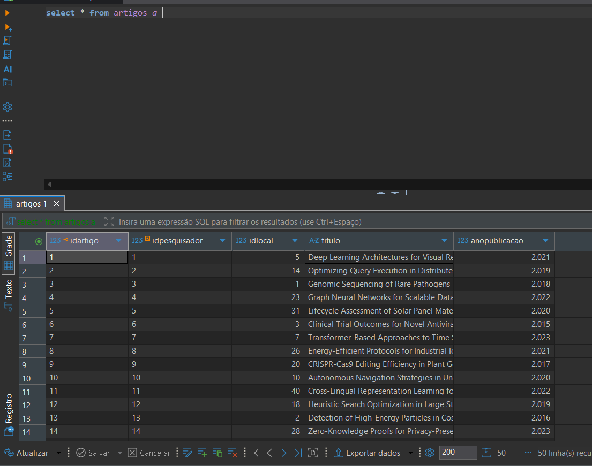
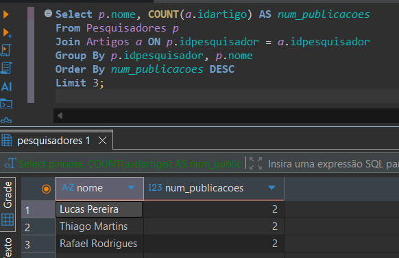
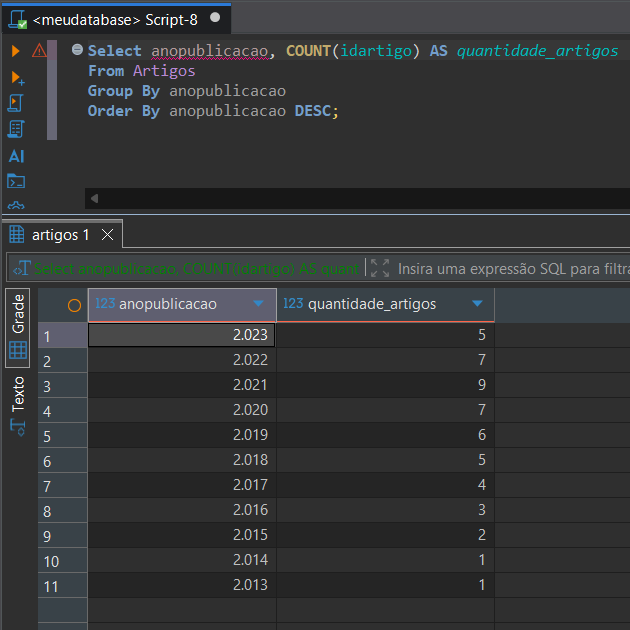
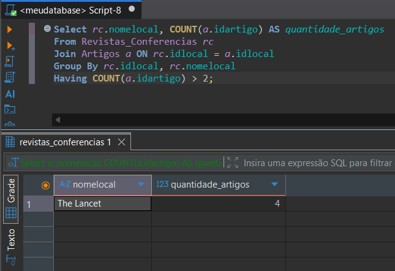

# Análise de Produção Acadêmica (SGBD - PostgreSQL)

Projeto desenvolvido como trabalho prático da disciplina de Banco de Dados, focando na modelagem relacional, manipulação e análise de dados sobre a produtividade acadêmica de um departamento de pesquisa.

---

## Tecnologias Utilizadas

* **SGBD:** PostgreSQL (via Docker Container)
* **IDE / Cliente SQL:** DBeaver
* **Linguagem:** SQL (DDL, DML, DQL)

---

## Cenário e Modelagem do Banco

O objetivo do banco de dados é gerenciar publicações de pesquisadores do departamento em diferentes veículos científicos (revistas e conferências). 

A tabela `Artigos` funciona como a tabela associativa entre `Pesquisadores` e `Revistas_Conferencias`, armazenando os títulos e anos de publicação.

### Visualização do Schema / Tabelas Criadas:


---

## Povoamento das Tabelas (DML)

Os dados foram inseridos de forma coerente e balanceada para garantir que as consultas analíticas retornem resultados significativos.

### Registros de Pesquisadores:


### Registros de Revistas e Conferências:


### Registros de Artigos Criados:


---

## Consultas Analíticas e Resultados

Abaixo estão as consultas desenvolvidas para responder às perguntas analíticas do projeto e seus respectivos retornos no banco de dados.

### 1. Quais são os 3 pesquisadores com o maior número de publicações?

```sql
SELECT 
    p.nome, 
    COUNT(a.idartigo) AS num_publicacoes
FROM Pesquisadores p
JOIN Artigos a ON p.idpesquisador = a.idpesquisador
GROUP BY p.idpesquisador, p.nome
ORDER BY num_publicacoes DESC
LIMIT 3;
```
**Resultado:**


---

### 2. Qual a quantidade de artigos publicados por ano, ordenados do ano mais recente para o mais antigo?

```sql
SELECT 
    anopublicacao, 
    COUNT(idartigo) AS quantidade_artigos
FROM Artigos
GROUP BY anopublicacao
ORDER BY anopublicacao DESC;
```
**Resultado:**


---

### 3. Liste as revistas/conferências que receberam mais de 2 publicações do departamento, junto com a contagem de artigos.

```sql
SELECT 
    rc.nomelocal, 
    COUNT(a.idartigo) AS quantidade_artigos
FROM Revistas_Conferencias rc
JOIN Artigos a ON rc.idlocal = a.idlocal
GROUP BY rc.idlocal, rc.nomelocal
HAVING COUNT(a.idartigo) > 2;
```
**Resultado:**


---

## Análises Avançadas e Automação (Miniprojeto 2)

A segunda fase do projeto introduz lógica de negócio avançada e auditoria automatizada diretamente no SGBD[cite: 7].

### 4. Ranking de Pesquisadores por Ano de Contratação (Window Function)

Esta consulta ranqueia os investigadores dentro do seu ano de contratação com base no número total de publicações[cite: 8], utilizando uma *Common Table Expression* (CTE) e a função `RANK()`[cite: 7].

```sql
WITH ContagemPublicacoes AS (
    SELECT 
        p.idpesquisador,
        p.nome,
        p.anocontratacao,
        COUNT(a.idartigo) AS numero_publicacoes
    FROM Pesquisadores p
    LEFT JOIN Artigos a ON p.idpesquisador = a.idpesquisador
    GROUP BY p.idpesquisador, p.nome, p.anocontratacao
)
SELECT 
    nome,
    anocontratacao,
    numero_publicacoes,
    RANK() OVER (PARTITION BY anocontratacao ORDER BY numero_publicacoes DESC) AS ranking
FROM ContagemPublicacoes;
```
*(Caso tires um print do resultado no DBeaver, podes adicionar a imagem aqui: ``)*

---

### 5. Auditoria de Exclusão de Artigos (Trigger)

Para garantir a integridade e rastreabilidade dos dados, foi implementada uma tabela de auditoria e um *Trigger* que regista automaticamente qualquer artigo eliminado da base de dados principal[cite: 7, 8].

**Tabela de Auditoria:**
```sql
CREATE TABLE Log_Artigos_Excluidos (
    idlog SERIAL PRIMARY KEY,
    idartigoexcluido INT,
    tituloexcluido VARCHAR(255),
    dataexclusao TIMESTAMP,
    usuariodb VARCHAR(255)
);
```

**Função e Trigger:**
```sql
CREATE OR REPLACE FUNCTION fn_log_exclusao_artigo()
RETURNS TRIGGER AS $$
BEGIN
    INSERT INTO Log_Artigos_Excluidos (idartigoexcluido, tituloexcluido, dataexclusao, usuariodb)
    VALUES (OLD.idartigo, OLD.titulo, CURRENT_TIMESTAMP, current_user);
    
    RETURN OLD;
END;
$$ LANGUAGE plpgsql;

CREATE TRIGGER trg_LogExclusaoArtigos
AFTER DELETE ON Artigos
FOR EACH ROW
EXECUTE FUNCTION fn_log_exclusao_artigo();
```
*(Caso tires um print da tabela Log_Artigos_Excluidos após um teste, podes adicionar a imagem aqui: ``)*

---

## 🚀 Como Executar o Projeto

1. Suba o container PostgreSQL no Docker via `docker-compose.yml`:
   ```bash
   docker compose up -d
   ```
2. Conecte ao banco através do **DBeaver** (`localhost:5432`).
3. Execute o arquivo `.sql` principal para recriar as tabelas e inserir os dados iniciais.
4. Execute o arquivo `carlos_augusto_mp2.sql` para testar as *Window Functions* e compilar o *Trigger* de auditoria.